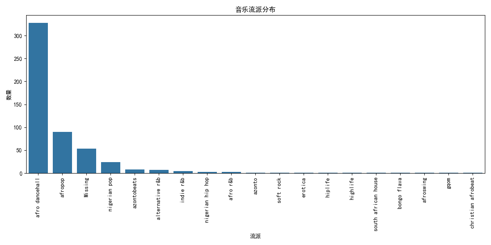

# 尼日利亚观众音乐品味的聚类模型🎧
## 数据概述
| 列名 | 含义                | 数据类型 |
| --- |-------------------| --- |
| name | 歌曲名称              | object |
| album | 所属专辑              | object |
| artist | 艺术家姓名             | object |
| artist_top_genre | 艺术家的主要音乐流派        | object |
| release_date | 发行日期              | int64 |
| length | 歌曲时长              | int64 |
| popularity | 歌曲的受欢迎程度          | int64 |
| danceability | 歌曲的可舞性程度，数值越高越适合跳舞 | float64 |
| acousticness | 歌曲的声学特性程度，如原声乐器的使用比例 | float64 |
| energy | 歌曲的活力程度，节奏、强度等方面的综合体现 | float64 |
| instrumentalness | 歌曲中器乐演奏的程度，是否以器乐为主 | float64 |
| liveness | 歌曲营造的现场感程度        | float64 |
| loudness | 歌曲的音量大小，以分贝等单位衡量  | float64 |
| speechiness | 歌曲中口语内容的比例        | float64 |
| tempo | 歌曲的节奏速度，每分钟节拍数    | float64 |
| time_signature | 歌曲的节拍规律 | int64 |

## 数据分析
1.音乐流派分析

非洲舞厅（afro dancehall）以显著的数量优势成为最受欢迎的音乐流派，其次是非洲流行（afropop）。其他流派如尼日利亚流行（nigerian pop）和阿松托节奏（azontobeats）也有一定的受众，
但数量相对较少。此外，数据中存在一定数量的流派信息缺失（Missing）。整体来看，流派分布呈现出明显的不均衡性，少数几个流派占据了大部分比例，而大多数流派的代表性较弱，这可能反映了尼日利亚音乐市场对某些特定流派的偏好，或者数据集的来源和范围可能偏向于这些流派。

2.歌曲时长分析

歌曲时长的统计数据显示，总共有530首歌曲，平均时长为222.3秒，标准差为39.7秒，表明大多数歌曲时长集中在这个平均值附近。
时长最短的歌曲为89.5秒，最长的达到511.7秒，中位数为218.5秒。从分布图可以看出，歌曲时长主要集中在200秒左右，呈现正态分布趋势，
但也有13个时长异常值，这些可能是过长或过短的歌曲。

3.歌手活跃度分析

可以看出，“Various Artists”以明显的优势位居榜首，拥有超过35首歌曲。紧随其后的是“Flavour”和“Wizkid”，他们的歌曲数量都在20首左右。
其他如“P-Square”、“Davido”和“Tekno”等歌手的歌曲数量则在15到10首之间。排名靠后的“Patoranking”、“Iyanya”、“Timaya”和“Olamide”的歌曲数量相对较少，但也显示出一定的活跃度。

4.音乐属性相关性分析

强相关特征对（相关系数绝对值>0.5）：

energy    loudness    0.73156

音乐属性相关性热图显示了不同音乐特征之间的相关性，其中能量（energy）和响度（loudness）之间的相关性最强，相关系数为0.73，表明能量较高的歌曲通常响度也较大。
此外，声学性（acousticness）与能量和舞蹈性（danceability）呈负相关，意味着声学性较强的歌曲可能能量较低且不太适合跳舞。

5.时间趋势分析

从2000年到2020年，每年发布的歌曲数量和歌曲平均流行度都呈现显著增长趋势，
尽管中间存在波动，尤其是2015年之后增长更为明显，反映出音乐产业的迅猛发展和消费需求的增加。

## 聚类数量确定
基于数据集中流派分布和音乐特征相似性，将音乐流派大致分为以下几类：

节奏强烈型、舒缓抒情型、说唱型、综合型

## 聚类结果分析
1.聚类内音乐特征分析

聚类0：呈现出流行融合特质，可舞性、活力等特征平衡，适配日常轻社交场景，对应综合型

聚类1：高可舞性、强节奏与高响度，专为舞池派对打造，是典型的节奏强烈型；

聚类2：突出原声乐器演奏，注重音乐艺术性与沉浸感，契合深度聆听，属于舒缓抒情型；

聚类3：以电子音效堆砌极致活力，节奏紧凑且说唱元素频繁，追求先锋听觉刺激，对应说唱型。

2.聚类与音乐流派的关系

从聚类分析结果来看，afro dancehall在4个聚类中均有分布，这一现象直观反映出音乐流派与风格并非完全等同的概念。
结合聚类与音乐流派关系的热图进一步观察：
聚类1以节奏强烈型为典型特征，其中"afro dancehall"流派占比显著，凭借高活力与强律动的特质成为该聚类的主导风格；

聚类0作为综合型聚类，呈现"afropop"等多流派共存的融合特征，体现了音乐元素的多元交织；

聚类2属于舒缓抒情型，"alternative r&b"等原声性强、活力较低的风格在此聚集；

聚类3为说唱型，其中"afro dancehall"不仅数量突出，更展现出与电子说唱风格深度融合的特点。  

这一分布规律揭示：音乐流派更多承载着特定文化身份与创作传统，为音乐创作提供基础框架，允许在框架内进行自由探索；
而音乐风格则由节奏、可舞性等具体音乐特征定义，同一流派会因制作理念差异、场景适配需求等因素，分化出不同的风格分支。

3.聚类与歌曲流行度的关系

聚类1靠强律动，流行度最高；聚类2借舒缓抒情风紧随其后；聚类0多流派融合，流行度居中；
聚类3因电子说唱融合小众，流行度稍低，展现风格、流派与流行度的关联逻辑。

4.聚类与发布时间的关系

前期（2000-2010 年）各聚类作品量少、发展慢；2010 年后，聚类3先快速增长，2015年前后达峰，引领创作潮，接着聚类1崛起，聚类0逐步攀升，聚类2一直小众。
这呼应风格流行周期，也体现流派创作侧重，反映音乐风格随年份演变的脉络 。