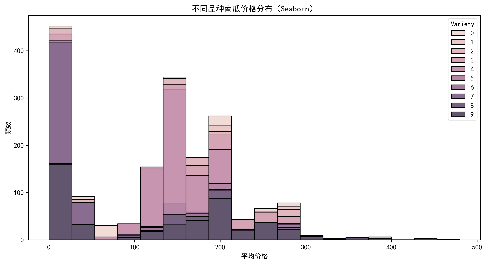
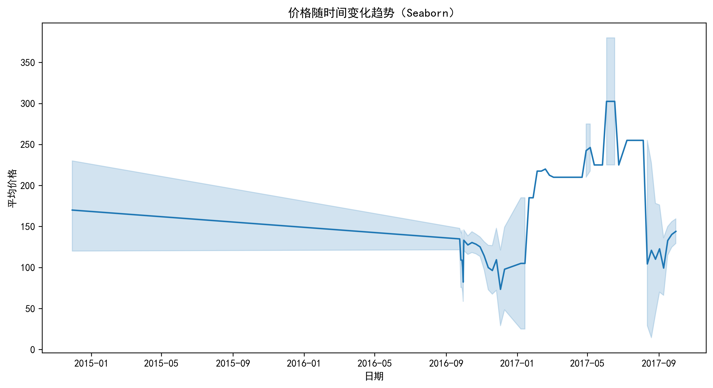

# Pumpkin 数据集数据分析
## 数据说明
US-pumpkins数据集共有 1757 行，26 列。

| 字段名 | 非空数量 | 数据类型 | 字段含义 |
| --- | --- | --- | --- |
| City Name | 1757 | object | 城市名称，记录南瓜交易或相关事件发生的城市 |
| Type | 45 | object | 南瓜类型 |
| Package | 1757 | object | 包装方式 |
| Variety | 1752 | object | 南瓜品种 |
| Sub Variety | 296 | object | 南瓜子品种 |
| Grade | 0 | float64 | 等级 |
| Date | 1757 | object | 交易日期 |
| Low Price | 1757 | float64 | 最低价格 |
| High Price | 1757 | float64 | 最高价格 |
| Mostly Low | 1654 | float64 | 多数情况下的最低价格 |
| Mostly High | 1654 | float64 | 多数情况下的最高价格 |
| Origin | 1754 | object | 产地 |
| Origin District | 131 | object | 产地所在区域 |
| Item Size | 1478 | object | 南瓜大小 |
| Color | 1141 | object | 颜色 |
| Environment | 0 | float64 | 环境相关 |
| Unit of Sale | 162 | object | 销售单位 |
| Quality | 0 | float64 | 质量 |
| Condition | 0 | float64 | 状况 |
| Appearance | 0 | float64 | 外观 |
| Storage | 0 | float64 | 存储情况 |
| Crop | 0 | float64 | 收成情况 |
| Repack | 1757 | object | 是否重新包装 |
| Trans Mode | 0 | float64 | 运输方式 |
| Unnamed: 24 | 0 | float64 | 未命名字段 24 |
| Unnamed: 25 | 103 | object | 未命名字段 25 |

## 数据处理阶段
1. 缺失值处理

该数据集存在缺失值，为了分析的准确性，对数据集进行缺失值处理：

删除非空字段数量低于总数量 50% 的字段；
对于分类字段的缺失值，使用众数进行填充；
对于数值字段的缺失值，使用均值进行填充。

2. Date字段处理

原始数据中Date字段的数据类型为object，为了便于进行基于日期的分析，
使用pd.to_datetime函数将Date字段转换为日期时间类型。
转换完成后，提取了年份和月份信息分别存储在新的列 Year 和 Month 中，
并统计了不同年份和不同月份的记录数。

3. 对分类字段进行编码
为了方便后续绘制特征热力图以及建模，
将数据集除了 Date 字段外的所有分类字段转换为类别类型，并对其进行编码，将类别值转换为数值代码

4. 计算平均价格
用 Low Price 和 High Price 两个字段计算平均价格，作为后续建模的目标列。

预处理后字段概述如下：

| 字段名 | 数据类型 | 含义                    |
| --- | --- |-----------------------|
| City Name | int8 | 城市名称，记录南瓜交易或相关事件发生的城市 |
| Package | int8 | 包装方式                  |
| Variety | int8 | 南瓜品种                  |
| Date | datetime64[ns] | 交易日期                  |
| Low Price | float64 | 最低价格                  |
| High Price | float64 | 最高价格                  |
| Mostly Low | float64 | 多数情况下的最低价格            |
| Mostly High | float64 | 多数情况下的最高价格            |
| Origin | int8 | 产地                    | 
| Item Size | int8 | 南瓜大小                  |
| Color | int8 | 颜色                    |
| Repack | int8 | 是否重新包装                |
| Year    |int32| 交易年份                  |
| Month   |int32| 交易月份                  |
| Average Price | float64 |平均价格|

## 数据分析阶段
选择Year、Month、City Name、Variety、Item Size和Average Price这些列用于建模。
交易年月可能会体现季节方面的影响；交易城市可能体现城市物价方面的影响；品种和大小则是体现南瓜本身属性方面的影响。

## 数据拟合阶段
1. 数据划分
将筛选后的数据划分为特征X（不包含平均价格列）和目标变量y（平均价格列），并按照 80:20 的比例划分为训练集和测试集。
2. 模型选择
选择选用 XGBoost 回归模型，选择默认参数。
XGBoost 是一种强大的集成学习算法，具有高效、准确且能处理复杂数据关系的特点，适合用于回归预测任务。
3. 模型训练与预测
使用训练集对模型进行训练，然后在测试集上进行预测，得到预测的南瓜平均价格。
4. 模型评估
使用均方误差（MSE）和决定系数（R²）对模型进行评估。
均方误差衡量预测值与真实值的偏差程度，决定系数反映模型对数据的拟合优度。

## 模型分析阶段

## 数据可视化分析
### 1. 价格与城市的关系
| Matplotlib 主要城市南瓜价格分布                                 | Seaborn 主要城市南瓜价格分布                      |
|-------------------------------------------------------|-----------------------------------------|
|  |  |
| 得手动调整配色、布局，适合精细控制细节，但步骤繁琐               | 默认配色美观，可自动优化分组展示，可以一键出图            |

### 2. 价格与品种的关系
| Matplotlib 不同品种南瓜价格分布                                     | Seaborn 不同品种南瓜价格分布                                 |
|-------------------------------------------------------|------------------------------------------------|
|  |  |
| 对多品种分布的分层展示需手动配置，代码量稍大 | 自动堆叠分组，品种间价格差异更直观，适配 “快速分析场景” |

### 3. 价格随时间的变化趋势
| Matplotlib 价格随时间变化趋势                           | Seaborn 价格随时间变化趋势                                 |
|------------------------------------------------|------------------------------------------------|
|  |  |
| 得手动设置时间轴、误差带等等，能灵活调整但费时间          |  lineplot 自带趋势线和置信区间，时序分析场景下，代码简单 |

### 4. 价格与尺寸的关系
| Matplotlib 价格和尺寸的关系                                   | Seaborn 价格和尺寸的关系                                |
|-------------------------------------------------------|-----------------------------------------------|
|  |  |
| 散点图功能全，但点大小、透明度这些样式优化，得逐行设置     | scatterplot 默认优化点分布，支持按尺寸映射颜色 / 大小，可视化更丰富  |

### 5. 总结
| 对比维度 | Matplotlib     | Seaborn             |
|------|----------------|---------------------|
| 实操难度 | 代码繁琐，需手动控制细节   | 封装高级API，方便操作        |
| 美观度  | 基础样式简洁，需手动优化细节 | 自带好看的配色和布局，默认出图非常美观 |
| 适用场景 | 需要精细图表的场景      | 快速分析、做汇报等追求效率的场景    |
